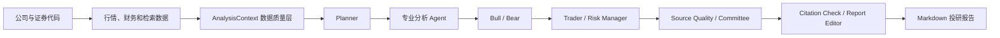

# DeepAlpha

DeepAlpha 是一个面向 A 股、港股和美股的多智能体投研系统。它将行情、财务、新闻与行业检索结果整理为统一上下文，由多个分析角色协作完成研究、风险审查、引用检查和 Markdown 报告生成。

项目目前处于原型阶段，适合技术验证、投研流程实验和内部演示。输出仅用于研究辅助，不构成投资建议或交易指令。

## 主要能力

- 使用 LangGraph 编排规划、基本面、财务、估值、技术面、新闻、情绪、多空辩论、交易、风控和委员会等分析节点。
- 通过统一行情路由支持 A 股、港股和美股，并记录 provider 尝试、降级路径和数据质量状态。
- 接入 Brave、BlockBeats 和 Tavily，可并发检索、去重、排序，并在外部服务失败时降级。
- 使用 Chroma 构建 RAG 检索层，保留来源域名、来源类型、发布时间、检索时间和质量分级。
- 对美股接入 SEC EDGAR companyfacts，提取常用利润表、资产负债表和现金流指标。
- 提供引用覆盖检查、Agent 执行轨迹、数据质量评分和 Markdown 报告编辑。
- 使用 SQLite 保存研究历史与关注列表；提供同步报告接口和轻量异步任务接口。
- React/Vite 工作台支持公司搜索、行情图表、报告生成、历史记录和 Watchlist。

## 工作流程



## 数据源

### 行情数据

当 `data_provider=auto` 时，系统按市场依次尝试以下来源：

| 市场 | 默认顺序 | 说明 |
| --- | --- | --- |
| A 股 | AkShare -> Efinance -> Baostock -> Yahoo | AkShare 是核心依赖，Efinance 和 Baostock 为可选增强源 |
| 港股 | Yahoo -> AkShare | Yahoo 为默认来源，失败后尝试 AkShare |
| 美股 | Yahoo -> Finnhub | Finnhub 需要配置 `FINNHUB_API_KEY` |

行情响应包含 `provider_attempts`、`fallback_from` 和 `provider_mode`，可用于判断是否发生数据源降级。显式指定 provider 时不会自动切换到其他来源。

### 财务与公开信息

| 数据类型 | 来源 | 覆盖范围 |
| --- | --- | --- |
| 公司财务 | SEC EDGAR companyfacts | 当前主要覆盖美股和提交 20-F 的外国发行人 |
| 通用网页检索 | Brave Search、Tavily | 需要对应 API Key |
| 垂直资讯 | BlockBeats | 适用于 Web3、链上和加密市场信息，需要 API Key |
| 本地测试 | Mock provider | 不用于真实投研结论 |

A 股和港股的交易所财报披露尚未接入，相关分析可能显示为 `not_supported`、`missing` 或 `partial`，不会伪造缺失数据。

## 技术栈

- 后端：Python、FastAPI、Pydantic
- Agent 编排：LangGraph
- LLM：OpenAI、DeepSeek 或本地 mock
- 检索：Chroma、Brave Search、BlockBeats、Tavily
- 数据：AkShare、Yahoo Finance、Finnhub、SEC EDGAR；Efinance 和 Baostock 可选
- 持久化：SQLite、Chroma
- 前端：React、Vite、Tailwind CSS、Lucide Icons
- 测试：pytest

## 快速开始

### 1. 安装后端

建议使用 Python 3.11 或 3.12 创建虚拟环境：

```bash
python -m venv .venv
source .venv/bin/activate
pip install -r requirements.txt
cp .env.example .env
```

默认配置使用仅限本地开发的 mock LLM 和 mock 搜索，无需 API Key：

```bash
uvicorn app.main:app --reload
```

服务启动后可访问：

- API：`http://127.0.0.1:8000`
- OpenAPI：`http://127.0.0.1:8000/docs`
- 健康检查：`http://127.0.0.1:8000/health`

### 2. 启动 React 前端

```bash
cd frontend
npm install
npm run dev
```

前端默认连接 `http://127.0.0.1:8000`。连接远程后端时，在 `frontend/.env` 中设置：

```env
VITE_API_BASE=https://api.example.com
```

## 配置

完整配置及默认值见 [`.env.example`](.env.example)。以下是常用选项。

### LLM

```env
LLM_PROVIDER=deepseek
DEEPSEEK_API_KEY=your_key
DEEPSEEK_BASE_URL=https://api.deepseek.com
```

也可以使用 OpenAI：

```env
LLM_PROVIDER=openai
OPENAI_API_KEY=your_key
OPENAI_MODEL=gpt-5
```

开发环境中，未配置有效 Key 或调用失败时可以使用 mock 输出，便于本地调试和自动化测试。生产环境不允许 mock：缺少 LLM 配置时服务拒绝启动，运行中的 LLM 请求失败时报告接口返回 HTTP 503。

### 多源搜索

```env
SEARCH_PROVIDER=multi
SEARCH_PROVIDERS=brave,blockbeats,tavily
SEARCH_MAX_WORKERS=3
BRAVE_SEARCH_API_KEY=your_key
BLOCKBEATS_API_KEY=your_key
TAVILY_API_KEY=your_key
```

多源模式会并发查询已配置的 provider，按 `SEARCH_PROVIDERS` 的顺序交错合并并去重。单个来源失败不会中断其他来源。所有真实来源均不可用时，开发环境可回退到 mock 搜索；生产环境返回空来源，并将 RAG 上下文标记为 `fetch_failed`。

### RAG

```env
RAG_EMBEDDING_PROVIDER=hash
RAG_FETCH_FULL_TEXT=false
RAG_FETCH_TIMEOUT_SECONDS=6
RAG_CHUNK_SIZE=900
RAG_CHUNK_OVERLAP=120
```

默认 hash embedding 可离线运行。设置 `RAG_EMBEDDING_PROVIDER=openai` 后可使用 OpenAI Embeddings。Chroma 不可用时，检索层会降级到内存关键词检索。

### 生产环境

```env
APP_ENV=production
ENABLE_DEBUG_ROUTES=false
CORS_ALLOW_ORIGIN_REGEX=https://app.example.com
DEEPALPHA_ACCESS_CODE=change-this-value
DEEPALPHA_DB_PATH=/var/lib/deepalpha/deepalpha.sqlite3
CHROMA_DB_PATH=/var/lib/deepalpha/chroma
SEC_USER_AGENT=DeepAlpha contact@example.com
```

报告接口支持用户、IP 和全站三级限额，相关变量包括：

- `REPORT_USER_DAILY_LIMIT`
- `REPORT_CREATE_RATE_LIMIT_PER_HOUR`
- `REPORT_CREATE_RATE_LIMIT_PER_DAY`
- `REPORT_GLOBAL_DAILY_LIMIT`

限额设为 `0` 时关闭对应限制。

`APP_ENV=production` 会启用启动校验：

- `LLM_PROVIDER` 必须是 `openai` 或 `deepseek`，且对应 API Key 必须存在。
- `SEARCH_PROVIDER` 必须指向 Brave、BlockBeats、Tavily 或 `multi`，且至少配置一个可用搜索 Key。
- mock provider 只能在 `development` 或测试环境使用。

## API

| 方法 | 路径 | 用途 |
| --- | --- | --- |
| `GET` | `/health` | 健康检查 |
| `GET` | `/config` | 查看当前 LLM、搜索和调试模式，不返回 API Key |
| `GET` | `/symbol/lookup` | 根据公司名或代码查询候选证券 |
| `GET` | `/market/chart` | 获取行情和 provider 降级信息 |
| `GET` | `/financials/latest` | 获取最新 SEC 财务摘要 |
| `POST` | `/analyze` | 返回完整 Agent 输出、上下文、引用和执行轨迹 |
| `POST` | `/report` | 返回适合前端展示的精简报告 |
| `POST` | `/report/tasks` | 创建后台报告任务 |
| `GET` | `/report/tasks/{task_id}` | 查询后台任务状态 |
| `GET` | `/memory/history` | 查询研究历史 |
| `GET/POST` | `/memory/watchlist` | 查询或新增关注标的 |

生成报告示例：

```bash
curl -X POST http://127.0.0.1:8000/report \
  -H "Content-Type: application/json" \
  -d '{
    "company_name": "Tesla",
    "symbol": "NASDAQ:TSLA",
    "yahoo_symbol": "TSLA",
    "exchange": "NASDAQ",
    "data_provider": "auto"
  }'
```

异步任务示例：

```bash
curl -X POST http://127.0.0.1:8000/report/tasks \
  -H "Content-Type: application/json" \
  -d '{"company_name":"Tesla","symbol":"NASDAQ:TSLA","data_provider":"auto"}'

curl http://127.0.0.1:8000/report/tasks/{task_id}
```

## 可靠性设计

- `AnalysisContextPack` 为行情、财务和 RAG 数据提供统一状态，包括 `available`、`fallback`、`partial`、`missing`、`not_supported` 和 `fetch_failed`。
- 外部 provider 请求使用 TTL 缓存、超时和基础限流；行情结果记录每次 provider 尝试。
- Agent 调用失败时由安全执行层捕获，避免单个节点直接终止整条研究流程。
- 引用检查器统计 claim-level coverage、有效链接、官方来源和检索分数。
- 调试接口由 `ENABLE_DEBUG_ROUTES` 控制，生产环境应关闭。

## 项目结构

```text
app/
  agents/          # 分析角色、委员会、风控与报告编辑
  llm/             # OpenAI 兼容 LLM 客户端
  memory/          # SQLite 研究历史与 Watchlist
  rag/             # 文档加载、向量存储与检索
  services/        # 上下文、缓存、财务、日志和限流
  tools/           # 行情、证券代码、搜索和 SEC 工具
  graph.py         # LangGraph 工作流
  main.py          # FastAPI 路由
frontend/          # React/Vite 前端
tests/             # API、行情路由和上下文测试
```

## 测试与构建

```bash
pytest -q
```

```bash
cd frontend
npm run build
```

## 部署

仓库包含 `Dockerfile`、`render.yaml`、`.env.zeabur.example` 和 `frontend/vercel.json`，可用于以下组合：

- FastAPI 后端：Docker、Render、Zeabur 或 Hugging Face Spaces
- React 前端：Vercel 或其他静态站点平台
- 持久化目录：`DEEPALPHA_DB_PATH` 与 `CHROMA_DB_PATH`

Docker 本地运行：

```bash
docker build -t deepalpha .
docker run --env-file .env -p 8000:8000 deepalpha
```

异步报告任务保存在当前进程内。多 worker 或多实例部署时，应将任务状态和分布式限流迁移到 Redis 或数据库。SQLite 适合单实例和演示环境；多租户生产系统应使用独立鉴权和外部数据库。

## 已知限制

- A 股和港股财务披露源尚未接入。
- 免费行情和搜索 provider 的可用性、频率限制与字段完整度可能变化。
- mock 模式仅用于开发与测试；生产启动校验会拒绝 mock provider。
- 当前访问码和限流机制适合受控演示，不等同于完整用户认证系统。
- 模型输出可能包含错误，引用覆盖率也不能替代人工核验。

## 免责声明

DeepAlpha 仅用于技术研究和信息整理。任何输出均不构成投资建议、交易指令、收益承诺或风险保证。使用者应独立核验数据和结论，并自行承担决策风险。
