# DeepAlpha


DeepAlpha 是一个面向 A 股、港股和美股的多智能体投研系统。用户输入公司或证券代码后，系统会拉取行情、财务、新闻与行业检索数据，交给一组专业分析 Agent 协作，最终生成带来源、数据质量说明和风险提示的 Markdown 投研报告。

当前项目定位是“研究辅助工具”和“投研工作流原型”。它可以帮助整理公开信息、形成分析框架、暴露数据缺口，但不提供投资建议、交易指令或收益承诺。

## 项目交付目标

本仓库按可复现的开源工程组织，目标是让使用者在本地完成安装、启动、验证和基础演示：

- 本地复现：clone 仓库后按文档启动后端和前端，使用开发模式的 mock provider 跑通主要流程。
- 网页演示：通过前端工作台展示证券检索、候选标的、行情图表、报告生成、历史记录和 Watchlist。
- 可配置生产运行：在配置真实 LLM、搜索和行情相关 Key 后，使用真实数据源生成研究辅助报告。

默认配置采用 `APP_ENV=development`、`LLM_PROVIDER=mock`、`SEARCH_PROVIDER=mock`，无需真实 API Key 即可启动项目并完成流程演示。生产模式必须配置真实 LLM 与搜索 provider；系统不会在生产环境用 mock 数据替代失败的真实来源。

## 运行模式速查

| 模式 | 推荐配置 | 适合场景 | 关键约束 |
| --- | --- | --- | --- |
| 本地演示 | `APP_ENV=development`、`LLM_PROVIDER=mock`、`SEARCH_PROVIDER=mock` | clone 后快速启动、前端功能演示、代码评审 | 报告内容为 mock LLM 输出，不能代表真实投研质量 |
| 联网开发 | `APP_ENV=development`、真实搜索 provider、可选真实 LLM | 调试搜索、行情、RAG 和报告链路 | 外部数据源可能限流，失败会反映在数据质量字段中 |
| 受控生产 | `APP_ENV=production`、`LLM_PROVIDER=deepseek/openai/anthropic/gemini/ollama/dashscope/zhipuai/aihubmix`、`SEARCH_PROVIDER=multi` | 小范围演示、内部试用、部署验证 | 必须配置真实 LLM 和至少一个真实搜索源；建议启用访问码和限流 |
| 公开部署 | 受控生产配置 + 独立域名 + GitHub Secrets/Variables + 持久化存储 | 公开 GitHub 项目展示和线上 Demo | 不要提交真实 Key；多实例部署需要外部任务存储和更完整鉴权 |

## 功能特性

| 能力 | 说明 |
| --- | --- |
| 多市场证券识别 | 支持 A 股、港股和美股的公司名、代码、别名与交易所信息解析。 |
| 行情与市场复盘 | 按市场路由 AkShare、Yahoo、Nasdaq、Finnhub、Efinance、Baostock 等 provider，并记录 fallback 与失败原因。 |
| 多 Agent 投研流程 | Planner、行业、基本面、财务、估值、技术、新闻、情绪、多空、交易观点、风控、来源质量和委员会节点协作生成报告。 |
| 财务数据接入 | 美股接入 SEC EDGAR companyfacts；A 股和港股通过 AkShare 获取财务摘要（含资产负债表和利润表补全指标）、多类型公告（含分类）、分析师盈利预测共识（东方财富/ETNET）、港股分红记录和南北向资金流向。 |
| RAG 与搜索 | 支持 Brave Search、BlockBeats、Tavily、SerpAPI、Bocha、SearXNG、可选 X MCP adapter 和 Chroma；开发模式可使用 mock provider 跑通流程。 |
| 数据质量治理 | 通过 `AnalysisContextPack` 标记 `available`、`fallback`、`partial`、`missing`、`not_supported`、`fetch_failed` 等状态。 |
| 报告可靠性 | 提供引用覆盖检查、来源质量评估、Agent trace、Markdown 编辑和风险提示。 |
| 报告追问 | 支持基于已生成报告、结构化画像和可选联网检索的结构化问答。 |
| Web 工作台 | React/Vite 三栏界面，覆盖公司搜索、候选证券、K 线图、报告生成、历史记录和 Watchlist。 |
| 生产约束 | `APP_ENV=production` 下禁止 mock LLM 和 mock 搜索；LLM 失败返回明确错误，搜索失败记录为缺失数据。 |

## 适用场景

- 个人或小团队做公开市场研究辅助。
- 验证多 Agent 投研流程、RAG 检索和数据质量治理。
- 搭建内部演示版的股票研究工作台。

不适合作为自动交易系统、投资顾问系统或不经人工复核的生产决策引擎。

## 系统流程

```mermaid
flowchart LR
    A["用户输入公司 / 证券代码"] --> B["证券识别与市场判断"]
    B --> C["行情、财务、新闻与行业检索"]
    C --> D["AnalysisContext 数据质量层"]
    D --> E["Planner"]
    E --> F["专业分析 Agent"]
    F --> G["Bull / Bear Debate"]
    G --> H["Trader / Risk Manager"]
    H --> I["Source Quality / Committee"]
    I --> J["Citation Check / Report Editor"]
    J --> K["Markdown 投研报告"]
```



## 技术栈

| 模块 | 技术 |
| --- | --- |
| 后端 | Python、FastAPI、Pydantic |
| Agent 编排 | LangGraph |
| LLM | DeepSeek、OpenAI、Claude、Gemini、Ollama、通义千问、智谱 GLM、AIHubMix、开发测试 mock |
| 检索 | Brave Search、BlockBeats、Tavily、SerpAPI、Bocha、SearXNG、可选 X MCP adapter、Chroma |
| 行情 / 市场复盘 | AkShare、Yahoo Finance、Nasdaq、Finnhub、Efinance、Baostock |
| 财务 | SEC EDGAR companyfacts、AkShare |
| 存储 | SQLite、Chroma |
| 前端 | React、Vite、Tailwind CSS、Lucide Icons |
| 测试 / CI | pytest、GitHub Actions、Vite build |

## 数据源与覆盖范围

### 行情数据

`data_provider=auto` 时，系统会按市场选择 provider 链。每次尝试都会记录在 `provider_attempts` 中，方便判断数据是主来源、降级来源还是失败。

| 市场 | 默认顺序 | 说明 |
| --- | --- | --- |
| A 股 | AkShare -> Efinance -> Baostock -> Yahoo | AkShare 是核心来源；Efinance、Baostock 为可选增强 |
| 港股 | AkShare 港股指数 -> Yahoo -> AkShare | 复盘指数优先走 AkShare 港股指数，Yahoo 作为降级源，港股个股继续可走 Yahoo/AkShare |
| 美股 | Nasdaq -> Yahoo -> Finnhub | Nasdaq 为无需密钥的主力美股源；Yahoo 作为降级增强；Finnhub 需要 `FINNHUB_API_KEY` |

显式指定 provider 时不会自动切换到其他来源。

### 市场复盘

`GET /market/review?market=auto|cn|hk|us` 会返回主要指数、涨跌幅、可用量能字段、市场状态、热点/板块占位摘要和数据质量状态。`market=auto` 同时返回 A 股、港股、美股三组复盘。

| 市场 | 指数范围 | 当前边界 |
| --- | --- | --- |
| A 股 | 上证指数、深证成指、创业板指、科创50 | 复用行情 provider 链，优先按 A 股 provider 路由；若板块表现或涨跌家数无法稳定获取，会保留为空并在 `context_status` 中标记质量 |
| 港股 | 恒生指数、恒生科技指数 | 优先 AkShare 港股指数历史行情；Yahoo 被限流或 AkShare 异常时保留 `provider_attempts` 和错误摘要 |
| 美股 | S&P 500、Nasdaq、Dow | 优先 Nasdaq；Nasdaq 被限流时，Nasdaq Composite 使用 Nasdaq 官方指数数据，S&P 500 / Dow 使用 SPY / DIA ETF 代理，并通过 `instrument_type`、`proxy_symbol`、`proxy_for` 明确标记 |

ETF 代理的涨跌幅可用于轻量复盘，但 ETF 收盘价不是指数点位，精确指数水平仍需结合指数行情终端复核。数据源失败时不会用 mock 代替，接口会返回 `available`、`partial`、`missing`、`fetch_failed` 或 `not_supported`。接口默认通过 `MARKET_REVIEW_CACHE_TTL_SECONDS=300` 缓存 5 分钟，并返回 `cache_hit` 与 `generated_at`，前端会展示 provider、来源链接、直接指数/ETF 代理标识。

### 数据源健康

`GET /health/providers` 会主动探测 Yahoo、Nasdaq、AkShare、Efinance、Baostock、Finnhub，并返回脱敏后的 provider 状态、耗时、覆盖市场和来源链接。默认通过 `PROVIDER_HEALTH_CACHE_TTL_SECONDS=300` 缓存 5 分钟；不会返回 API Key、环境变量、异常正文或 provider 原始响应。

返回的顶层 `status` 含义：

- `ok`：A 股、港股、美股至少各有一个可用 provider。
- `degraded`：只有部分市场有可用 provider。
- `unavailable`：核心市场都没有可用 provider。

### 财务、新闻与检索

| 数据类型 | 来源 | 当前边界 |
| --- | --- | --- |
| 美股财务 | SEC EDGAR companyfacts | 覆盖美国上市公司和部分提交 20-F 的外国发行人；SEC 元数据失败时保留结构化事实并标记 `partial` |
| A 股财务与公告 | AkShare 东方财富/新浪可用接口 | 提取收入、净利润、毛利率、净利率、ROE、资产负债率、经营现金流、营业利润、EPS、货币资金、短期/长期借款、股东权益等可映射字段，含同比变化；分业务收入结构（按产品/行业/地区分类，含收入占比和毛利率）；管理层正式业绩指引（业绩预告 + 业绩快报，含变动原因）；多类型公告（财务报告、重大事项、资产重组、持股变动、融资公告）经关键词分类为 11 个标准化类别；接入东方财富分析师盈利预测共识（EPS 预期、买卖评级、研报数）。字段缺失标记 `partial`，接口无记录标记 `missing`，调用失败标记 `fetch_failed` |
| 港股财务与公告 | AkShare 东方财富港股财务与公告接口 / yfinance | 优先返回公告/财报链接和财务指标（收入、净利润、毛利率等），含同比变化；补充资产负债表和利润表数据（经行转列 pivot）；接入 ETNET 券商盈利预测（含目标价和评级）和分红记录（派息方案、除净日）；yfinance 补充 GICS 行业分类、业务摘要（定性分业务板块参考）和增长率验证。结构化字段不稳定时只返回真实可得字段，并在 `missing_fields` 中标明缺口 |
| 资金流向 | AkShare 沪深港通资金流向 | 返回北向/南向成交净买额（市场级别），不作为个股信号 |
| 通用网页搜索 | Brave Search、Tavily | 需要 API Key |
| 搜索引擎聚合 | SerpAPI | 可补充 Google/Bing 等搜索结果，需要 API Key |
| 中文搜索 | Bocha | 适合中文新闻、A 股和港股语境，需要 API Key |
| 自建搜索 | SearXNG | 适合私有部署或低成本兜底，需要配置实例地址 |
| 垂直资讯 | BlockBeats | 适合 Web3、加密市场相关信息，需要 API Key |
| 社交信号 | X MCP adapter | 可选社交数据源，用于最新讨论、市场情绪和事件线索；需要自行提供 HTTP adapter |
| 本地开发 | mock provider | 仅限开发和自动化测试 |

## 快速开始

### 本地快速启动

```bash
git clone https://github.com/wannathan20-sketch/deepalpha.git
cd deepalpha
python -m venv .venv
source .venv/bin/activate
pip install -r requirements.txt
cp .env.example .env
uvicorn app.main:app --reload
```

另开一个终端启动前端：

```bash
cd frontend
npm install
npm run dev
```

打开 Vite 输出的本地地址后，可使用 `Tesla`、`NVDA`、`腾讯` 或 `贵州茅台` 验证检索、行情和报告流程。开发模式使用 mock LLM/search，适合功能演示和代码评审；实时行情仍依赖外部免费数据源，接口会通过数据质量字段标记限流、缺失或降级情况。

### 后端

建议使用 Python 3.11 或 3.12。

```bash
python -m venv .venv
source .venv/bin/activate
pip install -r requirements.txt
cp .env.example .env
uvicorn app.main:app --reload
```

默认 `.env.example` 使用开发模式，可在没有真实 LLM 和搜索 API Key 的情况下启动。

服务地址：

- API: `http://127.0.0.1:8000`
- OpenAPI: `http://127.0.0.1:8000/docs`
- Health check: `http://127.0.0.1:8000/health`

可用以下命令做最小检查：

```bash
curl http://127.0.0.1:8000/health
curl "http://127.0.0.1:8000/symbol/lookup?query=Tesla"
```

### 前端

```bash
cd frontend
npm install
npm run dev
```

默认连接本地后端 `http://127.0.0.1:8000`。生产域名 `https://deepalpha.best` 会默认连接 `https://api.deepalpha.best`。连接其它远程后端时，在 `frontend/.env` 中设置：

```env
VITE_API_BASE=https://api.deepalpha.best
```

### 前端演示路径

1. 输入公司名称或证券代码，例如 `Tesla`、`NVDA`、`腾讯`、`贵州茅台`。
2. 查看候选证券，确认市场、交易所和标准化代码。
3. 查看行情 provider、图表区域、fallback 记录和数据质量状态。
4. 创建报告任务，等待多 Agent 工作流生成 Markdown 报告。
5. 查看报告正文、历史记录、报告追问和来源质量提示。
6. 使用 Watchlist 导入或保存关注标的。

## 报告输出示例

报告以 Markdown 形式返回，前端会渲染标题、列表、链接和风险提示。典型结构如下：

```markdown
# Tesla 投研报告

## 核心结论
- 综合观点：中性偏积极，需结合估值和交付数据继续验证。
- 关键变量：交付量、汽车毛利率、FSD 进展、能源业务增速。

## 数据质量
- 行情：available，provider=yahoo。
- 财务：available，来源为 SEC companyfacts。
- 新闻与行业检索：partial，部分来源可能受搜索 API 覆盖影响。

## 基本面与财务
- 收入、利润率、现金流和资产负债结构摘要。
- 与历史同期或最近报告期的变化。

## 风险与跟踪事项
- 价格竞争、监管、需求波动、供应链和估值回撤风险。
- 后续关注交付数据、财报、管理层指引和主要监管披露。

## 来源
- SEC filing / companyfacts
- 行情 provider
- 新闻与行业检索结果
```

实际内容取决于运行模式、provider 可用性、搜索结果质量和 LLM 配置。所有结论都应由使用者复核。

### Watchlist 智能导入

前端 Watchlist 支持直接粘贴多行或逗号分隔股票代码/名称，例如：

```text
600519, 0700.HK, NVDA, 智谱AI, 京东
```

也支持最小 CSV 文本，只要包含 `symbol`、`name` 或 `company` 其中一列即可：

```csv
symbol
PLTR
中芯国际
```

导入会调用 `POST /symbol/resolve-batch`。高置信唯一结果会自动加入 Watchlist；多候选结果会在前端等待用户确认；失败项会显示错误，不会静默丢弃。

## 环境变量

完整示例见 [`.env.example`](.env.example) 和 [`.env.zeabur.example`](.env.zeabur.example)。不要提交真实 `.env`、API Key 或访问码。

### LLM

项目支持 8 个 LLM provider，通过 `LLM_PROVIDER` 环境变量选择。5 个走 OpenAI 兼容协议（与 DeepSeek 相同模式），Claude 走 Anthropic Messages API，Ollama 免 Key 本地运行。

**Provider 速查**

| Provider | `LLM_PROVIDER` | 需要 Key | 默认模型 | 免费额度 | 说明 |
| --- | --- | --- | --- | --- | --- |
| DeepSeek | `deepseek` | `DEEPSEEK_API_KEY` | `deepseek-chat` | ❌ 按量付费 | 推荐生产首选，性价比高 |
| OpenAI | `openai` | `OPENAI_API_KEY` | `gpt-5` | ❌ 按量付费 | 通用能力强 |
| Anthropic Claude | `anthropic` | `ANTHROPIC_API_KEY` | `claude-sonnet-4-6` | ❌ 按量付费 | 分析推理能力突出 |
| Google Gemini | `gemini` | `GEMINI_API_KEY` | `gemini-2.5-flash` | ✅ 15 RPM | 超大 context，免费额度足 |
| Ollama | `ollama` | 无 | `llama3` | ✅ 完全免费 | 本地运行，数据不出机器 |
| 通义千问 (DashScope) | `dashscope` | `DASHSCOPE_API_KEY` | `qwen-plus` | ✅ 百万 token | 阿里云，中文能力强 |
| 智谱 GLM (ZhipuAI) | `zhipuai` | `ZHIPUAI_API_KEY` | `glm-4-flash` | ✅ 免费额度 | 国产模型，注册即用 |
| AIHubMix | `aihubmix` | `AIHUBMIX_API_KEY` | `deepseek-chat` | ❌ 按量付费 | 聚合网关，一 Key 切全系 |

**推荐生产配置（DeepSeek）**

```env
APP_ENV=production
LLM_PROVIDER=deepseek
DEEPSEEK_API_KEY=your_deepseek_api_key
DEEPSEEK_MODEL=deepseek-chat
DEEPSEEK_BASE_URL=https://api.deepseek.com
```

**其他 provider 示例**

```env
# Anthropic Claude
LLM_PROVIDER=anthropic
ANTHROPIC_API_KEY=your_anthropic_api_key
ANTHROPIC_MODEL=claude-sonnet-4-6

# Google Gemini（免费 15 RPM）
LLM_PROVIDER=gemini
GEMINI_API_KEY=your_gemini_api_key
GEMINI_MODEL=gemini-2.5-flash

# Ollama 本地模型（先 ollama pull llama3）
LLM_PROVIDER=ollama
OLLAMA_BASE_URL=http://localhost:11434/v1
OLLAMA_MODEL=llama3

# 阿里云通义千问
LLM_PROVIDER=dashscope
DASHSCOPE_API_KEY=your_dashscope_api_key
DASHSCOPE_MODEL=qwen-plus

# 智谱 GLM
LLM_PROVIDER=zhipuai
ZHIPUAI_API_KEY=your_zhipuai_api_key
ZHIPUAI_MODEL=glm-4-flash

# AIHubMix 聚合网关
LLM_PROVIDER=aihubmix
AIHUBMIX_API_KEY=your_aihubmix_api_key
AIHUBMIX_MODEL=deepseek-chat
```

**生产环境规则**

- `LLM_PROVIDER` 必须是上述 8 个 provider 之一或 `ollama`，不允许 `mock`。
- 对应 API Key 必须存在（Ollama 除外）。
- LLM 调用失败时报告与追问接口返回 HTTP 503。
- mock LLM 只允许在开发和测试环境使用。

### 搜索

```env
SEARCH_PROVIDER=multi
SEARCH_PROVIDERS=brave,blockbeats,tavily,serpapi,bocha,searxng
SEARCH_MAX_WORKERS=4
BRAVE_SEARCH_API_KEY=your_brave_search_api_key
BLOCKBEATS_API_KEY=your_blockbeats_api_key
TAVILY_API_KEY=your_tavily_api_key
SERPAPI_API_KEY=your_serpapi_api_key
BOCHA_API_KEY=your_bocha_api_key
SEARXNG_BASE_URL=https://your-searxng.example.com
```

生产环境至少需要配置一个可用搜索来源，例如 API Key 或 SearXNG 实例地址。全部真实搜索来源失败时，RAG 上下文会标记为 `fetch_failed`，报告不会用 mock 来源补位。

搜索 provider 说明：

- `serpapi` 使用 SerpAPI REST 接口，适合补充实时搜索引擎结果；可通过 `SERPAPI_ENGINE`、`SERPAPI_HL`、`SERPAPI_GL` 调整搜索引擎和地区语言。
- `bocha` 使用 Bocha Web Search API，适合中文新闻、A 股、港股和中文网页摘要；可通过 `BOCHA_FRESHNESS` 控制时效窗口。
- `searxng` 连接自建 SearXNG 实例，适合私有部署或低成本兜底；需要配置 `SEARXNG_BASE_URL`。

搜索源选择矩阵：

| Provider | 是否需要 Key | 中文 | 英文 | 社交 | 加密 / Web3 | 推荐配置 |
| --- | --- | --- | --- | --- | --- | --- |
| `brave` | 是，`BRAVE_SEARCH_API_KEY` | 中 | 高 | 低 | 中 | 通用网页检索主力，推荐放在 `SEARCH_PROVIDERS` 第一或第二位。 |
| `tavily` | 是，`TAVILY_API_KEY` | 中 | 高 | 低 | 中 | 适合英文新闻、研究文章和网页摘要，推荐与 `brave` 组合。 |
| `serpapi` | 是，`SERPAPI_API_KEY` | 中 | 高 | 低 | 中 | 适合补充 Google/Bing 等搜索结果；中文场景建议设置 `SERPAPI_HL=zh-cn`、`SERPAPI_GL=cn`。 |
| `bocha` | 是，`BOCHA_API_KEY` | 高 | 中 | 低 | 中 | 适合中文新闻、A 股、港股和中文网页摘要；中文投研建议加入生产配置。 |
| `blockbeats` | 是，`BLOCKBEATS_API_KEY` | 高 | 中 | 低 | 高 | 适合 Web3、加密市场和链上事件资讯；非加密标的可不配置。 |
| `searxng` | 否；需要 `SEARXNG_BASE_URL` | 中 | 中 | 低 | 中 | 适合自建搜索、私有部署和低成本兜底；建议放在真实商业 API 之后。 |
| `x` | 取决于 adapter；`X_MCP_SEARCH_URL` 必填，`X_MCP_API_KEY` 可选 | 中 | 高 | 高 | 高 | 适合实时讨论、事件线索和市场情绪；只作为补充信号，不替代公告、财报和新闻源。 |
| `mock` | 否 | 低 | 低 | 低 | 低 | 仅用于本地开发和自动化测试；生产环境禁用。 |

推荐组合：

| 场景 | 推荐 `SEARCH_PROVIDERS` | 说明 |
| --- | --- | --- |
| 最小生产配置 | `brave,tavily` | 覆盖通用英文网页和新闻，配置简单。 |
| 中文投研 / A 股港股 | `bocha,brave,serpapi` | 中文结果优先，Brave 和 SerpAPI 补充跨语种资料。 |
| 美股 / 全球公司 | `brave,tavily,serpapi` | 英文网页、新闻和搜索引擎覆盖更稳。 |
| 加密 / Web3 标的 | `blockbeats,brave,tavily,x` | 垂直资讯配合通用搜索，X 只用于情绪和事件线索。 |
| 私有部署 / 成本敏感 | `searxng,brave` | SearXNG 做基础检索，关键场景用 Brave 补强。 |
| 演示 / 本地开发 | `mock` | 无需 Key，可跑通流程，但不能代表真实数据质量。 |

可选 X MCP 社交信号源：

```env
SEARCH_PROVIDER=multi
SEARCH_PROVIDERS=brave,tavily,x
X_MCP_SEARCH_URL=http://127.0.0.1:8787/search
X_MCP_API_KEY=optional_adapter_token
```

`x` provider 预期连接到一个由 MCP server 或本地服务封装出来的 HTTP adapter。请求格式为 `{"query": "...", "limit": 5}`，响应可返回 `results`、`tweets` 或 `data` 列表；每条结果建议包含 `text`、`author`、`url`、`created_at`。该数据会被标记为 `source_type=social`，适合补充实时讨论和情绪线索，不应替代财报、公告或监管披露。

### RAG 与存储

```env
RAG_EMBEDDING_PROVIDER=hash
RAG_FETCH_FULL_TEXT=false
RAG_CHUNK_SIZE=900
RAG_CHUNK_OVERLAP=120
DEEPALPHA_DB_PATH=data/deepalpha.sqlite3
CHROMA_DB_PATH=data/chroma
```

默认 hash embedding 可离线运行。SQLite 适合单实例演示；多实例生产部署建议改为外部数据库，并把任务状态和限流迁移到 Redis 或数据库。

### 访问控制与限流

```env
DEEPALPHA_ACCESS_CODE=change-this-value
REPORT_USER_DAILY_LIMIT=3
REPORT_CREATE_RATE_LIMIT_PER_HOUR=5
REPORT_CREATE_RATE_LIMIT_PER_DAY=10
REPORT_GLOBAL_DAILY_LIMIT=50
```

访问码和限流适合受控公测，不等同于完整用户系统。公开上线时建议配合登录、审计和更严格的额度管理。

### 生产安全

```env
ENABLE_DEBUG_ROUTES=false
CORS_ALLOW_ORIGIN_REGEX=https://(www\.)?deepalpha\.best
SEC_USER_AGENT=DeepAlpha production contact@example.com
```

`/config` 不返回真实 Key。`/debug/*` 路由受 `ENABLE_DEBUG_ROUTES` 控制，生产环境应关闭。

## API 概览

| 方法 | 路径 | 用途 |
| --- | --- | --- |
| `GET` | `/health` | 健康检查 |
| `GET` | `/health/providers` | 脱敏数据源健康检查 |
| `GET` | `/config` | 查看运行配置，不返回密钥 |
| `GET` | `/symbol/lookup` | 根据公司名或代码查询候选证券 |
| `POST` | `/symbol/resolve-batch` | 批量解析 Watchlist 导入文本或 CSV 中的证券 |
| `GET` | `/market/chart` | 获取行情和 provider 降级信息 |
| `GET` | `/market/review` | 获取 A 股、港股、美股市场复盘 |
| `GET` | `/financials/latest` | 获取 A 股/港股/美股财务数据、公告与管理层指引 |
| `POST` | `/analyze` | 返回完整 Agent 输出、上下文、引用和 trace |
| `POST` | `/report` | 返回前端展示用报告 |
| `POST` | `/report/tasks` | 创建后台报告任务 |
| `GET` | `/report/tasks/{task_id}` | 查询后台任务状态 |
| `POST` | `/chat/report` | 围绕已生成报告进行单次结构化追问 |
| `GET` | `/chat/report/{task_id}/history` | 查询报告追问历史 |
| `DELETE` | `/chat/report/{task_id}/history` | 清空报告追问历史 |
| `GET` | `/memory/history` | 查询研究历史 |
| `GET` | `/memory/history/detail/{history_id}` | 查询研究历史详情（含完整报告） |
| `GET` | `/memory/history/{company_name}` | 按公司名查询历史 |
| `DELETE` | `/memory/history/{history_id}` | 删除研究历史记录 |
| `GET` / `POST` | `/memory/watchlist` | 查询或新增关注标的 |

## 可选部署：CI 通过后发布到 Zeabur

仓库提供 `.github/workflows/deploy.yml` 作为后端自动部署示例。该 workflow 只在 `main` 分支的 `CI` workflow 成功完成后触发，部署同一个已验证 commit 到 Zeabur，并对后端 `/health` 进行冒烟检查。本地运行项目不需要启用该 workflow。

启用前需要：

1. 在 GitHub 仓库 Secrets 中添加 `ZEABUR_TOKEN`。
2. 在 GitHub 仓库 Variables 中配置：
   - `ZEABUR_PROJECT_ID`
   - `ZEABUR_SERVICE_ID`
   - `ZEABUR_ENVIRONMENT_ID`
   - `BACKEND_HEALTH_URL`
3. 在 Zeabur 控制台关闭该服务的原生 Git 自动部署，确保发布路径只经过 CI 门禁。

## 自定义域名

推荐域名结构：

- 前端：`https://deepalpha.best`
- 后端 API：`https://api.deepalpha.best`

前端生产包会在访问 `deepalpha.best` 或 `www.deepalpha.best` 时默认请求 `https://api.deepalpha.best`。如果前端部署在其它域名，请设置 `VITE_API_BASE`。

后端需要在 Zeabur 绑定 `api.deepalpha.best`，并在域名服务商处添加 Zeabur 要求的 CNAME 记录。后端生产 CORS 应设置：

```env
CORS_ALLOW_ORIGIN_REGEX=https://(www\.)?deepalpha\.best
```

生成报告示例：

```bash
curl -X POST http://127.0.0.1:8000/report \
  -H "Content-Type: application/json" \
  -d '{
    "company_name": "Tesla",
    "symbol": "NASDAQ:TSLA",
    "yahoo_symbol": "TSLA",
    "exchange": "NASDAQ",
    "data_provider": "auto"
  }'
```

异步任务示例：

```bash
curl -X POST http://127.0.0.1:8000/report/tasks \
  -H "Content-Type: application/json" \
  -d '{"company_name":"Tesla","symbol":"NASDAQ:TSLA","data_provider":"auto"}'

curl http://127.0.0.1:8000/report/tasks/{task_id}
```

报告追问支持使用已完成任务的 `task_id`：

```bash
curl -X POST http://127.0.0.1:8000/chat/report \
  -H "Content-Type: application/json" \
  -d '{
    "company_name": "Tesla",
    "question": "当前报告中最需要持续验证的风险是什么？",
    "task_id": "{task_id}",
    "strategy": "risk"
  }'
```

也可以直接提交报告 Markdown：

```bash
curl -X POST http://127.0.0.1:8000/chat/report \
  -H "Content-Type: application/json" \
  -d '{
    "company_name": "Tesla",
    "question": "请概括估值判断及其关键假设。",
    "markdown_report": "# Tesla 投研报告\n...",
    "strategy": "valuation"
  }'
```

`strategy` 可选值为 `general`、`risk`、`valuation`、`technical`、`news`，默认为 `general`。响应固定包含：

- `answer`
- `key_points`
- `risks`
- `cited_sources`
- `data_quality_warning`

`task_id` 模式会使用任务保存的报告、行情画像、财务画像和来源质量；直接 Markdown 模式保持无状态。引用链接会限制为报告上下文或本次联网检索中已有的来源。生产环境 LLM 调用失败、空响应或非法 JSON 均返回 HTTP 503，不使用 mock 答案兜底。

### 报告追问 V2

完成的报告任务支持按 `X-DeepAlpha-User-Id + task_id` 保存追问历史。每次回答使用最近 6 轮完整问答，刷新页面后会恢复最后一份报告及其会话；不同匿名用户之间相互隔离。直接提交 `markdown_report` 仍是无状态兼容模式。

请求可通过 `search_mode` 控制联网：

- `auto`：默认；“最新、今天、现在、近期、latest、today”等时效问题自动搜索。
- `report_only`：仅使用报告、结构化画像和最近 6 轮。
- `web`：强制联网补充。

联网失败时会降级为报告问答，并在 `route.web_status` 与 `data_quality_warning` 中说明；LLM 失败仍返回 HTTP 503。回答额外包含：

- `route`：确定性路由模式、时效识别和联网状态。
- `report_citations`：经过章节 ID、连续原文摘录和 URL 白名单校验的报告证据。
- `web_citations`：本次搜索返回且被模型实际引用的网络证据。
- `freshness`：报告生成时间、联网检索时间和回答数据截止时间。

历史接口：

```bash
curl http://127.0.0.1:8000/chat/report/{task_id}/history \
  -H "X-DeepAlpha-User-Id: user-id"

curl -X DELETE http://127.0.0.1:8000/chat/report/{task_id}/history \
  -H "X-DeepAlpha-User-Id: user-id"
```

## 项目结构

```text
app/
  agents/          # 分析角色、委员会、风控与报告编辑
  llm/             # 多 provider LLM 客户端（OpenAI 兼容 + Anthropic SDK）
  memory/          # SQLite 研究历史与 Watchlist
  rag/             # 文档加载、向量存储与检索
  services/        # 上下文、缓存、财务、日志和限流
  tools/           # 行情、证券代码、搜索和 SEC 工具
  graph.py         # LangGraph 工作流
  main.py          # FastAPI 路由
frontend/          # React/Vite 前端
tests/             # API、行情路由、生产可靠性和上下文测试
```

## 测试与构建

后端：

```bash
pytest -q
```

前端：

```bash
cd frontend
npm run test:stock
npm run build
```

GitHub Actions 会在 push 和 pull request 时运行后端测试与前端构建。

## 常用命令

| 场景 | 命令 |
| --- | --- |
| 启动后端 | `uvicorn app.main:app --reload` |
| 启动前端 | `cd frontend && npm run dev` |
| 后端健康检查 | `curl http://127.0.0.1:8000/health` |
| 证券查询 | `curl "http://127.0.0.1:8000/symbol/lookup?query=Tesla"` |
| 后端测试 | `pytest -q` |
| Python 编译检查 | `python -m compileall -q app tests` |
| 前端测试 | `cd frontend && npm run test:stock` |
| 前端生产构建 | `cd frontend && npm run build` |
| 检查忽略文件跟踪状态 | `git ls-files -ci --exclude-standard` |

## 部署

仓库包含以下部署文件：

- `Dockerfile`: 后端容器构建。
- `render.yaml`: Render 后端部署示例。
- `.env.zeabur.example`: Zeabur 后端环境变量示例。
- `frontend/vercel.json`: Vercel 前端配置。

常见部署组合：

- 后端：Zeabur、Render、Docker 主机或其他支持 Python/FastAPI 的平台。
- 前端：Vercel 或其他静态站点平台。
- 持久化：为 `DEEPALPHA_DB_PATH` 和 `CHROMA_DB_PATH` 挂载持久化目录。

Docker 本地运行：

```bash
docker build -t deepalpha .
docker run --env-file .env -p 8000:8000 deepalpha
```

## 安全与仓库规范

仓库只应提交源码、测试、示例配置和部署模板。以下内容必须保留在本地或部署平台中：

- `.env`、个人环境变量文件、真实 API Key 和访问码。
- SQLite 数据库、Chroma 数据目录、前端构建产物和依赖目录。
- 本地过程文档、调试记录、临时报告和私有部署信息。

公开发布前建议执行：

```bash
git status --short
git ls-files -ci --exclude-standard
```

第一条命令用于确认待提交变更，第二条命令用于检查是否仍有被 `.gitignore` 忽略的文件处于 Git 跟踪状态。

生产部署要求：

- `APP_ENV=production`。
- `ENABLE_DEBUG_ROUTES=false`。
- 真实 API Key 只配置在部署平台的环境变量或 GitHub Secrets/Variables 中。
- 对公开演示环境启用 `DEEPALPHA_ACCESS_CODE` 和报告限流，降低 LLM 与搜索 API 滥用风险。

当前仓库不应包含：

- 本地 `.env` 或其它真实环境变量文件。
- `data/*.sqlite3`、`data/*.db`、`data/chroma/`。
- `frontend/dist/`、`frontend/node_modules/`。
- `PROJECT_STATE.md`、`docs/superpowers/`、`DeepAlpha_*.md` 等过程资料。

## 已知限制

- 港股分业务收入已通过 yfinance 业务摘要提供定性分类（板块名称 + GICS 行业），但结构化营收数字需付费数据源（Bloomberg/Wind）；港股和美股业绩会原文转录仍需补充。A 股分业务数据已通过 AkShare 主营构成接口覆盖，管理层正式业绩指引已接入业绩预告和业绩快报。
- 免费或低成本行情、搜索 provider 可能限流，字段完整度也可能变化。
- 当前异步任务状态保存在进程内，多 worker 或多实例部署需要外部任务存储。
- 访问码和基础限流适合受控演示，不是完整鉴权体系。
- LLM 输出必须人工复核，引用覆盖检查不能替代专业判断。

## 免责声明

DeepAlpha 仅用于技术研究和信息整理。任何输出均不构成投资建议、交易指令、收益承诺或风险保证。使用者应独立核验数据和结论，并自行承担决策风险。
