# DeepAlpha


DeepAlpha 是一个面向 A 股、港股和美股的多智能体投研系统。用户输入公司或证券代码后，系统会拉取行情、财务、新闻与行业检索数据，交给一组专业分析 Agent 协作，最终生成带来源、数据质量说明和风险提示的 Markdown 投研报告。

当前项目定位是“研究辅助工具”和“投研工作流原型”。它可以帮助整理公开信息、形成分析框架、暴露数据缺口，但不提供投资建议、交易指令或收益承诺。

## 核心能力

- 多市场支持：A 股、港股、美股的证券识别、行情路由、市场复盘和图表展示。
- 多 Agent 工作流：规划、行业、基本面、财务、估值、技术、新闻、情绪、多空辩论、交易观点、风险审查、来源质量和委员会总结。
- 多源检索：支持 Brave Search、BlockBeats、Tavily；生产环境搜索失败时标记数据缺失，不用 mock 伪造来源。
- 财务数据：美股接入 SEC EDGAR companyfacts；A 股和港股接入 AkShare 可用财务摘要与公告接口，按字段稳定性标记数据质量。
- 数据质量层：用 `AnalysisContextPack` 标记 `available`、`fallback`、`partial`、`missing`、`not_supported`、`fetch_failed` 等状态。
- 报告可靠性：引用覆盖检查、来源质量评估、Agent trace、Markdown 报告编辑和风险提示。
- 生产约束：`APP_ENV=production` 下禁止 mock LLM 和 mock 搜索；LLM 失败返回明确错误，搜索失败记录为缺失数据。
- 前端工作台：React/Vite 三栏界面，支持公司搜索、候选证券、K 线图、报告生成、历史记录、Watchlist 和 Watchlist 智能导入。

## 适用场景

- 个人或小团队做公开市场研究辅助。
- 验证多 Agent 投研流程、RAG 检索和数据质量治理。
- 搭建内部演示版的股票研究工作台。

不适合作为自动交易系统、投资顾问系统或不经人工复核的生产决策引擎。

## 系统流程

```mermaid
flowchart LR
    A["用户输入公司 / 证券代码"] --> B["证券识别与市场判断"]
    B --> C["行情、财务、新闻与行业检索"]
    C --> D["AnalysisContext 数据质量层"]
    D --> E["Planner"]
    E --> F["专业分析 Agent"]
    F --> G["Bull / Bear Debate"]
    G --> H["Trader / Risk Manager"]
    H --> I["Source Quality / Committee"]
    I --> J["Citation Check / Report Editor"]
    J --> K["Markdown 投研报告"]
```



## 技术栈

| 模块 | 技术 |
| --- | --- |
| 后端 | Python、FastAPI、Pydantic |
| Agent 编排 | LangGraph |
| LLM | DeepSeek、OpenAI、开发测试 mock |
| 检索 | Brave Search、BlockBeats、Tavily、Chroma |
| 行情 / 市场复盘 | AkShare、Yahoo Finance、Nasdaq、Finnhub、Efinance、Baostock |
| 财务 | SEC EDGAR companyfacts、AkShare |
| 存储 | SQLite、Chroma |
| 前端 | React、Vite、Tailwind CSS、Lucide Icons |
| 测试 / CI | pytest、GitHub Actions、Vite build |

## 数据源与覆盖范围

### 行情数据

`data_provider=auto` 时，系统会按市场选择 provider 链。每次尝试都会记录在 `provider_attempts` 中，方便判断数据是主来源、降级来源还是失败。

| 市场 | 默认顺序 | 说明 |
| --- | --- | --- |
| A 股 | AkShare -> Efinance -> Baostock -> Yahoo | AkShare 是核心来源；Efinance、Baostock 为可选增强 |
| 港股 | AkShare 港股指数 -> Yahoo -> AkShare | 复盘指数优先走 AkShare 港股指数，Yahoo 作为降级源，港股个股继续可走 Yahoo/AkShare |
| 美股 | Yahoo -> Nasdaq -> Finnhub | Nasdaq 为无需密钥的复盘降级源；Finnhub 需要 `FINNHUB_API_KEY` |

显式指定 provider 时不会自动切换到其他来源。

### 市场复盘

`GET /market/review?market=auto|cn|hk|us` 会返回主要指数、涨跌幅、可用量能字段、市场状态、热点/板块占位摘要和数据质量状态。`market=auto` 同时返回 A 股、港股、美股三组复盘。

| 市场 | 指数范围 | 当前边界 |
| --- | --- | --- |
| A 股 | 上证指数、深证成指、创业板指、科创50 | 复用行情 provider 链，优先按 A 股 provider 路由；若板块表现或涨跌家数无法稳定获取，会保留为空并在 `context_status` 中标记质量 |
| 港股 | 恒生指数、恒生科技指数 | 优先 AkShare 港股指数历史行情；Yahoo 被限流或 AkShare 异常时保留 `provider_attempts` 和错误摘要 |
| 美股 | S&P 500、Nasdaq、Dow | 优先 Yahoo；Yahoo 被限流时，Nasdaq Composite 使用 Nasdaq 官方指数数据，S&P 500 / Dow 使用 SPY / DIA ETF 代理，并通过 `instrument_type`、`proxy_symbol`、`proxy_for` 明确标记 |

ETF 代理的涨跌幅可用于轻量复盘，但 ETF 收盘价不是指数点位，精确指数水平仍需结合指数行情终端复核。数据源失败时不会用 mock 代替，接口会返回 `available`、`partial`、`missing`、`fetch_failed` 或 `not_supported`。接口默认通过 `MARKET_REVIEW_CACHE_TTL_SECONDS=300` 缓存 5 分钟，并返回 `cache_hit` 与 `generated_at`，前端会展示 provider、来源链接、直接指数/ETF 代理标识。

### 数据源健康

`GET /health/providers` 会主动探测 Yahoo、Nasdaq、AkShare、Efinance、Baostock、Finnhub，并返回脱敏后的 provider 状态、耗时、覆盖市场和来源链接。默认通过 `PROVIDER_HEALTH_CACHE_TTL_SECONDS=300` 缓存 5 分钟；不会返回 API Key、环境变量、异常正文或 provider 原始响应。

返回的顶层 `status` 含义：

- `ok`：A 股、港股、美股至少各有一个可用 provider。
- `degraded`：只有部分市场有可用 provider。
- `unavailable`：核心市场都没有可用 provider。

### 财务、新闻与检索

| 数据类型 | 来源 | 当前边界 |
| --- | --- | --- |
| 美股财务 | SEC EDGAR companyfacts | 覆盖美国上市公司和部分提交 20-F 的外国发行人；SEC 元数据失败时保留结构化事实并标记 `partial` |
| A 股财务与公告 | AkShare 东方财富/新浪可用接口 | 提取最近财务摘要中的收入、净利润、毛利率、净利率、ROE、资产负债率、经营现金流等可映射字段，并附最近财报公告链接；字段缺失标记 `partial`，接口无记录标记 `missing`，调用失败标记 `fetch_failed` |
| 港股财务与公告 | AkShare 东方财富港股财务与公告接口 | 优先返回公告/财报链接和可稳定映射的基础摘要；结构化字段不稳定时只返回真实可得字段，并在 `missing_fields` 中标明缺口，不用估算或 mock 补数 |
| 通用网页搜索 | Brave Search、Tavily | 需要 API Key |
| 垂直资讯 | BlockBeats | 适合 Web3、加密市场相关信息，需要 API Key |
| 本地开发 | mock provider | 仅限开发和自动化测试 |

## 快速开始

### 后端

建议使用 Python 3.11 或 3.12。

```bash
python -m venv .venv
source .venv/bin/activate
pip install -r requirements.txt
cp .env.example .env
uvicorn app.main:app --reload
```

默认 `.env.example` 使用开发模式，可在没有真实 LLM 和搜索 API Key 的情况下启动。

服务地址：

- API: `http://127.0.0.1:8000`
- OpenAPI: `http://127.0.0.1:8000/docs`
- Health check: `http://127.0.0.1:8000/health`

### 前端

```bash
cd frontend
npm install
npm run dev
```

默认连接本地后端 `http://127.0.0.1:8000`。生产域名 `https://deepalpha.best` 会默认连接 `https://api.deepalpha.best`。连接其它远程后端时，在 `frontend/.env` 中设置：

```env
VITE_API_BASE=https://api.deepalpha.best
```

### Watchlist 智能导入

前端 Watchlist 支持直接粘贴多行或逗号分隔股票代码/名称，例如：

```text
600519, 0700.HK, NVDA, 智谱AI, 京东
```

也支持最小 CSV 文本，只要包含 `symbol`、`name` 或 `company` 其中一列即可：

```csv
symbol
PLTR
中芯国际
```

导入会调用 `POST /symbol/resolve-batch`。高置信唯一结果会自动加入 Watchlist；多候选结果会在前端等待用户确认；失败项会显示错误，不会静默丢弃。

## 环境变量

完整示例见 [`.env.example`](.env.example) 和 [`.env.zeabur.example`](.env.zeabur.example)。不要提交真实 `.env`、API Key 或访问码。

### LLM

推荐生产环境使用 DeepSeek：

```env
APP_ENV=production
LLM_PROVIDER=deepseek
DEEPSEEK_API_KEY=your_deepseek_api_key
DEEPSEEK_BASE_URL=https://api.deepseek.com
```

也可以使用 OpenAI：

```env
LLM_PROVIDER=openai
OPENAI_API_KEY=your_openai_api_key
OPENAI_MODEL=gpt-5
```

生产环境规则：

- `LLM_PROVIDER` 必须是 `deepseek` 或 `openai`。
- 对应 API Key 必须存在。
- LLM 调用失败时报告与报告追问接口返回 HTTP 503。
- mock LLM 只允许在开发和测试环境使用。

### 搜索

```env
SEARCH_PROVIDER=multi
SEARCH_PROVIDERS=brave,blockbeats,tavily
SEARCH_MAX_WORKERS=4
BRAVE_SEARCH_API_KEY=your_brave_search_api_key
BLOCKBEATS_API_KEY=your_blockbeats_api_key
TAVILY_API_KEY=your_tavily_api_key
```

生产环境至少需要配置一个可用搜索 Key。全部真实搜索来源失败时，RAG 上下文会标记为 `fetch_failed`，报告不会用 mock 来源补位。

### RAG 与存储

```env
RAG_EMBEDDING_PROVIDER=hash
RAG_FETCH_FULL_TEXT=false
RAG_CHUNK_SIZE=900
RAG_CHUNK_OVERLAP=120
DEEPALPHA_DB_PATH=data/deepalpha.sqlite3
CHROMA_DB_PATH=data/chroma
```

默认 hash embedding 可离线运行。SQLite 适合单实例演示；多实例生产部署建议改为外部数据库，并把任务状态和限流迁移到 Redis 或数据库。

### 访问控制与限流

```env
DEEPALPHA_ACCESS_CODE=change-this-value
REPORT_USER_DAILY_LIMIT=3
REPORT_CREATE_RATE_LIMIT_PER_HOUR=5
REPORT_CREATE_RATE_LIMIT_PER_DAY=10
REPORT_GLOBAL_DAILY_LIMIT=50
```

访问码和限流适合受控公测，不等同于完整用户系统。公开上线时建议配合登录、审计和更严格的额度管理。

### 生产安全

```env
ENABLE_DEBUG_ROUTES=false
CORS_ALLOW_ORIGIN_REGEX=https://(www\.)?deepalpha\.best
SEC_USER_AGENT=DeepAlpha production contact@example.com
```

`/config` 不返回真实 Key。`/debug/*` 路由受 `ENABLE_DEBUG_ROUTES` 控制，生产环境应关闭。

## API 概览

| 方法 | 路径 | 用途 |
| --- | --- | --- |
| `GET` | `/health` | 健康检查 |
| `GET` | `/health/providers` | 脱敏数据源健康检查 |
| `GET` | `/config` | 查看运行配置，不返回密钥 |
| `GET` | `/symbol/lookup` | 根据公司名或代码查询候选证券 |
| `GET` | `/market/chart` | 获取行情和 provider 降级信息 |
| `GET` | `/financials/latest` | 获取 SEC 财务摘要 |
| `POST` | `/analyze` | 返回完整 Agent 输出、上下文、引用和 trace |
| `POST` | `/report` | 返回前端展示用报告 |
| `POST` | `/report/tasks` | 创建后台报告任务 |
| `GET` | `/report/tasks/{task_id}` | 查询后台任务状态 |
| `POST` | `/chat/report` | 围绕已生成报告进行单次结构化追问 |
| `GET` | `/memory/history` | 查询研究历史 |
| `GET` / `POST` | `/memory/watchlist` | 查询或新增关注标的 |

## CI 全绿后部署 Zeabur

仓库包含 `.github/workflows/deploy.yml`。它只会在 `main` 分支的 `CI` workflow 成功完成后运行，部署被 CI 验证过的同一个 commit 到 Zeabur 后端服务，并对 `/health` 做冒烟测试。

启用前需要：

1. 在 GitHub 仓库 Secrets 中添加 `ZEABUR_TOKEN`。
2. 在 Zeabur 控制台关闭该服务的原生 Git 自动部署，避免绕过 CI 门禁重复上线。
3. 保持后端服务的 Zeabur project/service/environment ID 与 workflow 中配置一致。

## 自定义域名

推荐域名结构：

- 前端：`https://deepalpha.best`
- 后端 API：`https://api.deepalpha.best`

前端生产包会在访问 `deepalpha.best` 或 `www.deepalpha.best` 时默认请求 `https://api.deepalpha.best`。如果前端部署在其它域名，请设置 `VITE_API_BASE`。

后端需要在 Zeabur 绑定 `api.deepalpha.best`，并在域名服务商处添加 Zeabur 要求的 CNAME 记录。后端生产 CORS 应设置：

```env
CORS_ALLOW_ORIGIN_REGEX=https://(www\.)?deepalpha\.best
```

生成报告示例：

```bash
curl -X POST http://127.0.0.1:8000/report \
  -H "Content-Type: application/json" \
  -d '{
    "company_name": "Tesla",
    "symbol": "NASDAQ:TSLA",
    "yahoo_symbol": "TSLA",
    "exchange": "NASDAQ",
    "data_provider": "auto"
  }'
```

异步任务示例：

```bash
curl -X POST http://127.0.0.1:8000/report/tasks \
  -H "Content-Type: application/json" \
  -d '{"company_name":"Tesla","symbol":"NASDAQ:TSLA","data_provider":"auto"}'

curl http://127.0.0.1:8000/report/tasks/{task_id}
```

报告追问支持使用已完成任务的 `task_id`：

```bash
curl -X POST http://127.0.0.1:8000/chat/report \
  -H "Content-Type: application/json" \
  -d '{
    "company_name": "Tesla",
    "question": "当前报告中最需要持续验证的风险是什么？",
    "task_id": "{task_id}",
    "strategy": "risk"
  }'
```

也可以直接提交报告 Markdown：

```bash
curl -X POST http://127.0.0.1:8000/chat/report \
  -H "Content-Type: application/json" \
  -d '{
    "company_name": "Tesla",
    "question": "请概括估值判断及其关键假设。",
    "markdown_report": "# Tesla 投研报告\n...",
    "strategy": "valuation"
  }'
```

`strategy` 可选值为 `general`、`risk`、`valuation`、`technical`、`news`，默认为 `general`。响应固定包含：

- `answer`
- `key_points`
- `risks`
- `cited_sources`
- `data_quality_warning`

`task_id` 模式会使用任务保存的报告、行情画像、财务画像和来源质量；直接 Markdown 模式保持无状态。引用链接会限制为报告上下文或本次联网检索中已有的来源。生产环境 LLM 调用失败、空响应或非法 JSON 均返回 HTTP 503，不使用 mock 答案兜底。

### 报告追问 V2

完成的报告任务支持按 `X-DeepAlpha-User-Id + task_id` 保存追问历史。每次回答使用最近 6 轮完整问答，刷新页面后会恢复最后一份报告及其会话；不同匿名用户之间相互隔离。直接提交 `markdown_report` 仍是无状态兼容模式。

请求可通过 `search_mode` 控制联网：

- `auto`：默认；“最新、今天、现在、近期、latest、today”等时效问题自动搜索。
- `report_only`：仅使用报告、结构化画像和最近 6 轮。
- `web`：强制联网补充。

联网失败时会降级为报告问答，并在 `route.web_status` 与 `data_quality_warning` 中说明；LLM 失败仍返回 HTTP 503。回答额外包含：

- `route`：确定性路由模式、时效识别和联网状态。
- `report_citations`：经过章节 ID、连续原文摘录和 URL 白名单校验的报告证据。
- `web_citations`：本次搜索返回且被模型实际引用的网络证据。
- `freshness`：报告生成时间、联网检索时间和回答数据截止时间。

历史接口：

```bash
curl http://127.0.0.1:8000/chat/report/{task_id}/history \
  -H "X-DeepAlpha-User-Id: user-id"

curl -X DELETE http://127.0.0.1:8000/chat/report/{task_id}/history \
  -H "X-DeepAlpha-User-Id: user-id"
```

## 项目结构

```text
app/
  agents/          # 分析角色、委员会、风控与报告编辑
  llm/             # OpenAI-compatible LLM 客户端
  memory/          # SQLite 研究历史与 Watchlist
  rag/             # 文档加载、向量存储与检索
  services/        # 上下文、缓存、财务、日志和限流
  tools/           # 行情、证券代码、搜索和 SEC 工具
  graph.py         # LangGraph 工作流
  main.py          # FastAPI 路由
frontend/          # React/Vite 前端
tests/             # API、行情路由、生产可靠性和上下文测试
```

## 测试与构建

后端：

```bash
pytest -q
```

前端：

```bash
cd frontend
npm run build
```

GitHub Actions 会在 push 和 pull request 时运行后端测试与前端构建。

## 部署

仓库包含以下部署文件：

- `Dockerfile`: 后端容器构建。
- `render.yaml`: Render 后端部署示例。
- `.env.zeabur.example`: Zeabur 后端环境变量示例。
- `frontend/vercel.json`: Vercel 前端配置。

常见部署组合：

- 后端：Zeabur、Render、Docker 主机或其他支持 Python/FastAPI 的平台。
- 前端：Vercel 或其他静态站点平台。
- 持久化：为 `DEEPALPHA_DB_PATH` 和 `CHROMA_DB_PATH` 挂载持久化目录。

Docker 本地运行：

```bash
docker build -t deepalpha .
docker run --env-file .env -p 8000:8000 deepalpha
```

## 安全与仓库规范

- `.env`、数据库、Chroma 数据目录、前端构建产物和本地过程文档不应提交到 Git。
- README 和 env 示例只保留占位值，真实 API Key 应配置在部署平台的环境变量中。
- 生产环境请设置 `APP_ENV=production`，并关闭 `ENABLE_DEBUG_ROUTES`。
- 公开体验版建议启用 `DEEPALPHA_ACCESS_CODE` 和报告限流，避免 LLM 与搜索 API 被滥用。

## 已知限制

- A 股和港股的交易所公告、分业务财务和管理层指引尚未接入。
- 免费或低成本行情、搜索 provider 可能限流，字段完整度也可能变化。
- 当前异步任务状态保存在进程内，多 worker 或多实例部署需要外部任务存储。
- 访问码和基础限流适合受控演示，不是完整鉴权体系。
- LLM 输出必须人工复核，引用覆盖检查不能替代专业判断。

## 免责声明

DeepAlpha 仅用于技术研究和信息整理。任何输出均不构成投资建议、交易指令、收益承诺或风险保证。使用者应独立核验数据和结论，并自行承担决策风险。
